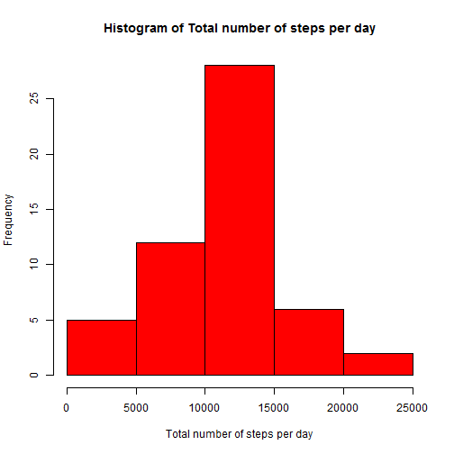
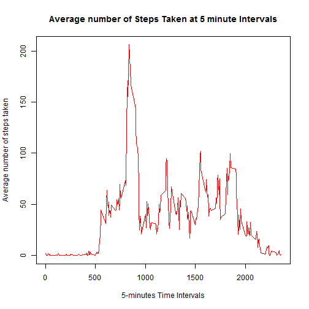
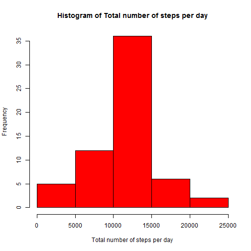

##Loading and preprocessing the data
1. Load the data


```r
data <-read.csv("activity.csv")
```

2. Process/transform the data (if necessary) into a format suitable for your analysis

```r
totalStepsperDay <- aggregate(steps ~ date, data = data, sum, na.rm=TRUE)
```

##What is mean total number of steps taken per day?
1. Make a histogram of the total number of steps taken each day


```r
hist(totalStepsperDay$steps, col="red", xlab="Total number of steps per day", 
     main="Histogram of Total number of steps per day")
```

 

2.Calculate and report the mean and median total number of steps taken per day

```r
MeanSteps <- mean(totalStepsperDay$steps)
MedianSteps<-median(totalStepsperDay$steps)
```
The mean total number of steps taken per day is 10766 steps.
The median total number of steps taken per day is 10765 steps.

##What is the average daily activity pattern?
1. Make a time series plot (i.e. type = "l") of the 5-minute interval (x-axis) and the average number of steps taken, averaged across all days (y-axis)

```r
avgSteps <-aggregate(steps ~ interval, data = data, mean, na.rm=TRUE)
plot(avgSteps$interval, avgSteps$steps, type = "l", xlab = "5-minutes Time Intervals",ylab = "Average number of steps taken", main = "Average number of Steps Taken at 5 minute Intervals",col = "red")
```

 

2.Which 5-minute interval, on average across all the days in the dataset, contains the maximum number of steps?

```r
maxInterval <-avgSteps[which.max(avgSteps$steps), ]$interval
```
It is the interval 835.

##Imputing missing values
1. Calculate and report the total number of missing values in the dataset (i.e. the total number of rows with NAs)

```r
missingVal <-sum(is.na(data))
```
There are 2034 NA values.
2.Devise a strategy for filling in all of the missing values in the dataset. The strategy does not need to be sophisticated. For example, you could use the mean/median for that day, or the mean for that 5-minute interval, etc.

```r
FillSteps <-function(interval) {
        avgSteps[avgSteps$interval ==interval,]$steps
}
```
3.Create a new dataset that is equal to the original dataset but with the missing data filled in.

```r
dataFilled <-data
count = 0
for (i in 1:nrow(dataFilled)) {
        if (is.na(dataFilled[i, ]$steps)) {
        dataFilled[i,]$steps<- FillSteps(dataFilled[i,]$interval)
        count =count + 1
        }        
}
cat("Total ", count, "NA values were filled.\n")
```

```
## Total  2304 NA values were filled.
```
4.Make a histogram of the total number of steps taken each day and Calculate and report the mean and median total number of steps taken per day.

```r
totalStepsperDayFilled <- aggregate(steps ~ date, data = dataFilled, sum, na.rm=TRUE)
hist(totalStepsperDayFilled$steps, col="red", xlab="Total number of steps per day", 
     main="Histogram of Total number of steps per day")
```

 

```r
MeanStepsFilled <- mean(totalStepsperDayFilled$steps)
MedianStepsFilled<-median(totalStepsperDayFilled$steps)
```
Both the mean and median values is 10766 steps per day

Do these values differ from the estimates from the first part of the assignment? What is the impact of imputing missing data on the estimates of the total daily number of steps?  

The **mean value** is the same as the value before the missing data is replaced, because the strategy relies on mean value of the steps for the particular 5-min interval. The median value is slighlt higher, but it depends on the distribution of the misisng values

##Are there differences in activity patterns between weekdays and weekends?
1.Create a new factor variable in the dataset with two levels - "weekday" and "weekend" indicating whether a given date is a weekday or weekend day.

```r
weekdays <- c("Monday", "Tuesday", "Wednesday", "Thursday", 
              "Friday")
dataFilled$day = as.factor(ifelse(is.element(weekdays(as.Date(dataFilled$date)),weekdays), "Weekday", "Weekend"))
```
2.Make a panel plot containing a time series plot (i.e. type = "l") of the 5-minute interval (x-axis) and the average number of steps taken, averaged across all weekday days or weekend days (y-axis). See the README file in the GitHub repository to see an example of what this plot should look like using simulated data.

```r
avgStep2 <- aggregate(steps ~ interval + day, data = dataFilled, mean)
library(lattice)
xyplot(avgStep2$steps ~ avgStep2$interval|avgStep2$day, data = dataFilled,
     main="Average Steps per Day by Interval",xlab="Interval", ylab="Steps",
     layout=c(1,2), type="l")
```

 
opts_chunk$set(cache=TRUE, cache.path = 'DocumentName_cache/', fig.path='figure/')
